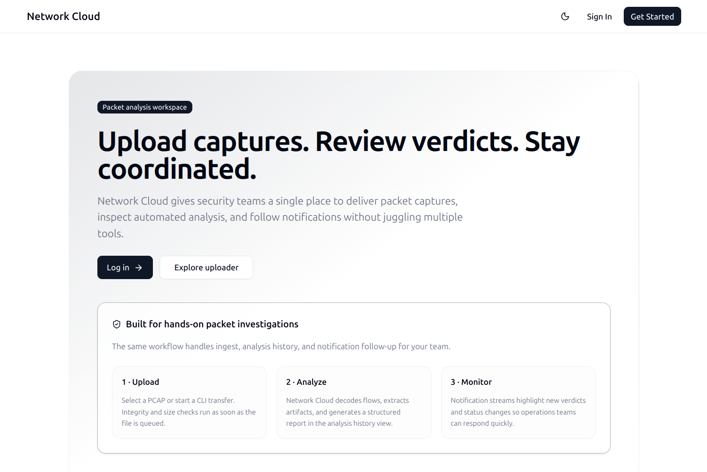
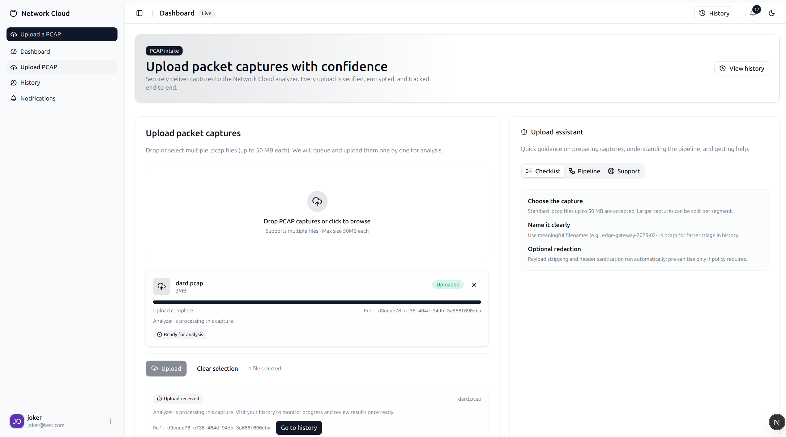
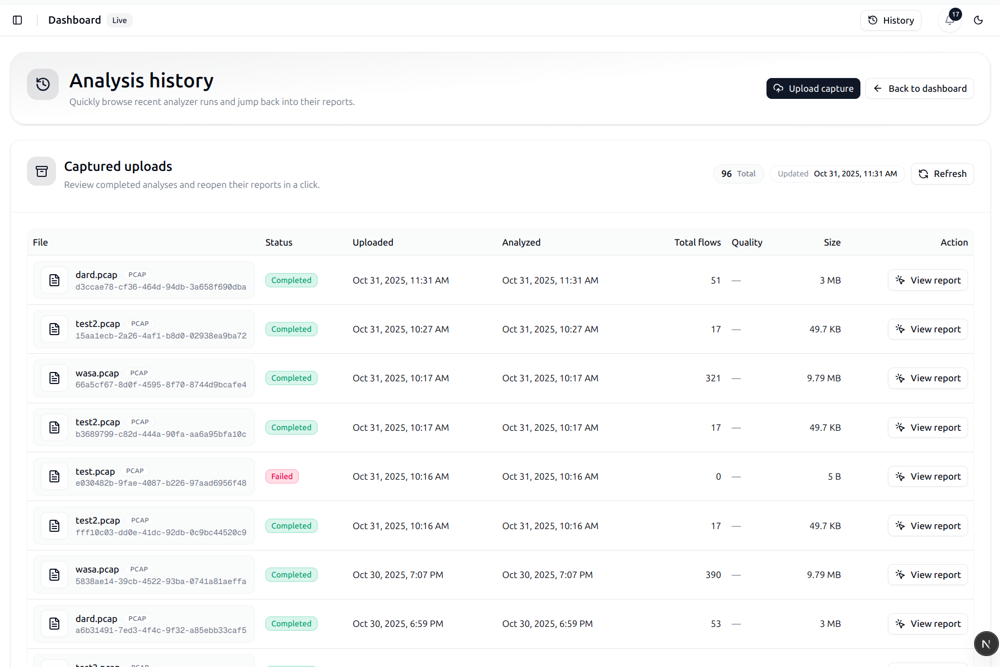
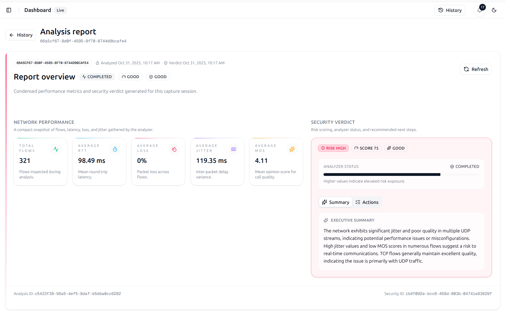
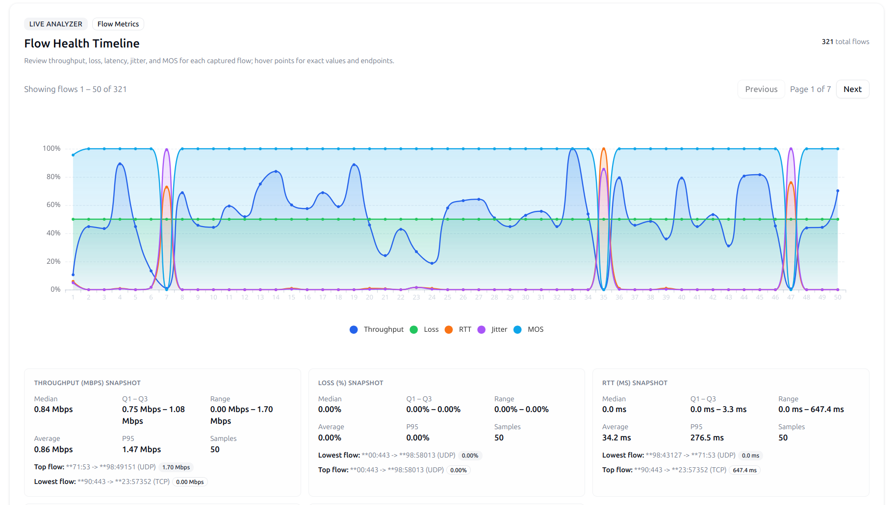
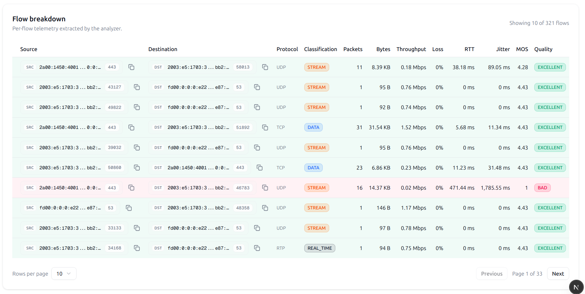
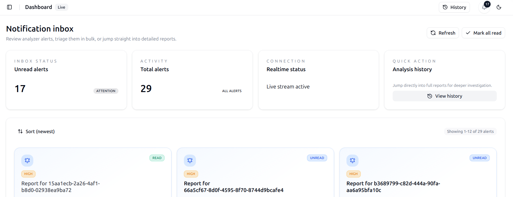

# Cloud Network

A Next.js 15 + React 19 application that powers the Network Cloud dashboard. The UI lets analysts upload PCAP captures, review flow and security reports, and receive live notifications from the analysis pipeline.

<p align="center">
  
</p>

## Screenshots













## Features

- **PCAP upload workflow** – drag-and-drop queuing for multiple capture files with progress, retry, and proxying to the backend API gateway.
- **Analysis reporting** – rich report views with flow metric visualisations (ECharts), tables, and summary cards.
- **Security insights** – security report hooks ready to consume service outputs.
- **Realtime notifications** – WebSocket + polling fallback for alerts, including a navbar bell and connection banner.
- **Role-aware routing** – middleware and protected-route helpers to enforce access rules based on session tokens.
- **Theme & layout system** – shared navigation chrome, theme toggling, and a library of reusable UI primitives.

## Tech Stack

- **Framework**: Next.js 15 (App Router) with React 19 and turbopack builds.
- **Styling**: Tailwind CSS 4 utilities with shadcn-inspired component primitives.
- **Auth & Sessions**: NextAuth.js, Keycloak integration, JWT parsing with `jose`.
- **Forms & State**: React Hook Form, Zod validation, custom hooks.
- **Charts**: `echarts` via `echarts-for-react` for flow metric visualisations.
- **Notifications**: WebSocket client (`ws`) with REST fallbacks.
## Getting Started

### Prerequisites

- Node.js 20 or later (matching the Next.js 15 requirement)
- npm 10 (bundled with Node) or another package manager (project ships with `package-lock.json`)

### Installation

```bash
npm install
```

### Environment Variables

Create a `.env.local` file in the project root. The runtime expects the variables validated in `src/core/config/env.server.ts` and `src/core/config/env.edge.ts`.

| Variable | Required | Description |
| --- | --- | --- |
| `KEYCLOAK_URL` | ✅ | Base URL of the Keycloak identity provider. |
| `KEYCLOAK_REALM` | ✅ | Keycloak realm used for authentication. |
| `KEYCLOAK_CLIENT_ID` | ✅ | OAuth client ID configured for the frontend. |
| `KEYCLOAK_CLIENT_SECRET` | optional | Client secret if confidential flow is used. |
| `OIDC_REDIRECT_URI` | ✅ | Redirect URI registered with Keycloak. |
| `SPRING_BASE_URL` | optional | Base URL for Spring backend services. |
| `API_GATEWAY_URL` | ✅ | Gateway URL the frontend proxies API calls to. |
| `OPA_URL` | optional | Open Policy Agent endpoint for additional policy checks. |
| `SESSION_SECRET` | ✅ | Random 32+ char secret for sessions and JWT verification. |
| `SESSION_TTL` | ✅ | Session lifetime in seconds (default 1800). |
| `NEXT_PUBLIC_NOTIFICATIONS_WS_URL` | optional | `ws://` or `wss://` endpoint for real-time notifications. |

You can also supply `NEXTAUTH_SECRET` if you want NextAuth to use a separate signing secret.

### Development

```bash
# start local development server
npm run dev

# build for production
npm run build

# serve the production build
npm run start
```

The upload and reporting flows rely on the API gateway endpoints (e.g. `/api/pcap/upload`, `/api/notifications`). Ensure the gateway is reachable from your dev environment or mock responses accordingly.

## Project Structure

```
src/
  app/                     # Next.js routes (App Router)
  components/              # UI components (see components/README.md for details)
  core/                    # Environment helpers, utils, shared config
  features/                # Domain-specific hooks and modules (auth, notifications, etc.)
  server/                  # Server-side helpers (middleware, audit, csrf)
  app/api/                 # Route handlers proxying to backend services
```

- `components/README.md` documents the component library.
- `features/**` groups logic by domain to keep hooks, API access, and helpers encapsulated.
- `server/middleware` houses the edge middleware and utilities shared by `src/middleware.ts`.

